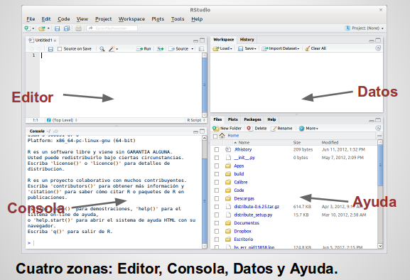

## En Homenaje 

> *a la Lic. Karla Contreras Dávila*

# R

## R

- No debería ser necesario a estar alturas tener que explicar en unas Jornadas
Estadísticas que es R.

- Se puede encontrar una introducción en http://bit.ly/introR

- R es el entorno de análisis estadístico y generación de gráficos más avanzado,
más utilizado, más flexible, más potente y con la mejor relación precio/valor
del planeta.

- Para usar R de forma eficaz y eficiente tienes que saber programar. Por lo
general, la gente no sabe programar porque el uso de la ofimática (léase: Word y
Excel) les ha inhabilitado para aprender.

## Instalar R I

### En Windows

- http://www.r-project.org $\rightarrow$ `CRAN`  
$\rightarrow$ `0-Cloud` http://cran.rstudio.com/  
$\rightarrow$ `Download R for Windows`  
$\rightarrow$ `install R for the first time`  
$\rightarrow$ `Download R 3.1.3 for Windows`

- Se descarga el archivo http://cran.rstudio.com/bin/windows/base/R-3.1.3-win.exe
y se ejecuta el instalador.

## Instalar R II

### En Linux

- La versión que viene en los repositorios oficiales de las principales
distribuciones linux suele estar obsoleta.

- Para obtener la versión mas reciente de R se añade el repositorio apropiado según se indica en http://cran.rstudio.com/bin/linux/ubuntu/, y se ejecutan los siguientes comandos:

- ```
$ sudo apt-get update
$ sudo apt-key adv --keyserver keyserver.ubuntu.com --recv-keys E084DAB9
$ sudo apt-get install r-base r-base-dev
```

## RStudio

- Tienes que tener previamente instalado R o R Open  
http://mran.revolutionanalytics.com/open/  
(Revolution Analytics fue comprada por Microsoft)

- http://www.rstudio.com/  
$\rightarrow$  `Download RStudio`  
$\rightarrow$  `Download RStudio Desktop`

- Seleccionar el instalador apropiado para nuestra plataforma (Windows|Mac OS X|Linux).

- Descargar e instalar.

## Interfaz de RStudio



# Reportes dinámicos

## knitr

- [knitr](http://yihui.name/knitr/) ha sido desarrollado por Yihui Xei, Phd por
el Dpto. Estadística Iowa State. Actualmente empleado por RStudio Inc.

- Es un paquete genérico para intercalar código R ejecutable con texto en diversos
formatos (por ejemplo: LaTeX, HTML, Markdown, AsciiDoc, y reStructuredText).

- El formato de texto que ha ganado mayor difusión es **R Markdown**.

## Flujo de trabajo con knitr

1. Abrir un archivo con la extensión `.Rmd`.

2. Preparar el documento con la sintaxis `R Markdown`.

3. Insertar trozos de código en R para las salidas dinámicas del reporte.

4. Generar el documento, lo que reemplaza el código R por su salida, y
transformar el reporte al formato indicado: presentación, pdf, html o ms Word.

## Ejemplo # 1a

```{r}
# Un ejemplo de código fuera de `R` aquí;
# sabemos que el valor de $\pi$ es `r pi`.
# 
# ```{r, echo=FALSE, fig.height=3, fig.width=6}
# set.seed(1213)  # para hacerlo reproducible
# x <- cumsum(rnorm(100))
# mean(x)  # media de x
# plot(x, type = 'l')  # Brownian motion
# ```
```

## Ejemplo 1b

Un ejemplo de código fuera de `R` aquí;
sabemos que el valor de $\pi$ es `r pi`.

```{r, echo=FALSE, fig.height=3, fig.width=6}
set.seed(1213)  # para hacerlo reproducible
x <- cumsum(rnorm(100))
mean(x)  # media de x
plot(x, type = 'l')  # Brownian motion
```

## R markdown

- Ver documentación en http://rmarkdown.rstudio.com.

- Para los ansiosos buscar la chuleta respectiva en http://www.rstudio.com/resources/cheatsheets/

- R Markdown es un formato de edición diseñado como una extensión del lenguaje
de marcado ligero markdown al que se le intercalan trozos de código R.

- Los documentos R markdown son completamente reproducibles (puede regenerarse
automáticamente aunque cambie el código R o los datos)

- RStudio utiliza R Markdown v2 con mejoras para formatos de salida,
presentaciones, tablas y bibliografías, personalización de la salida,
compilación desde scripts de R, extensible, etc.

## Trozos (chunks) de R

- Es código R que va encerrado entre

- ```{r}
# ```{r}
# ```
```

- Después de la `r` se pueden introducir opciones separadas por comas.

- Estas opciones controlan la salida y el procesamiento de estos trozos de
código.

- Soporta el uso de "cache" y la inclusión de trozos de `Rcpp`

## YAML

- Al principio de los documentos se indican los metadatos y las opciones de
procesamiento utilizando el lenguaje de marcado ligero YAML "YAML Ain't Markup
Language"

- Es un formato de serialización legible para humanos, usado para compartir
datos como sustitución de XML.

- ```{r}
# ---
# title: "Reportes Dinámicos y Aplicaciones Web interactivas con R"
# author: "Francisco Palm"
# date: "18 de marzo de 2015"
# output:
#   ioslides_presentation:
#     incremental: yes
# ---
```

## Ejemplo 2

- R crash course in R

- Script de Robin Edwards UCL/CASA http://geotheory.co.uk/blog/a-crash-course-in-r/

- Ejecutar `rmarkdown::render("r_crash_course.R")`

- Para ver los archivos intermedios `rmarkdown::render("r_crash_course.R", clean=FALSE)`


## Tablas

 - Existen varias opciones para renderizar las tablas en R markdown:
 
 - `kable()` es una función incluida en el paquete knitr, es buena para la mayoría de las situaciones. Requiere cargar explícitamente el paquete `knitr` con `library(knitr)`.
 
 - `pander()` es una buena opción, es necesario instalar el paquete `pander`. Se debe cargar en el código del trozo de R con `library(pander)`.
 
 - `xtable()` es la opción más flexible, también en su propio paquete `xtable`. Se debe cargar igualmente. Requiere utilizar la opción `results=asis` en la cabecera del trozo.


## Aplicar CSS

- Para personalizar la apariencia de nuestros reportes en HTML podemos utilizar hojas de estilo en cascada (CSS).

- En los reportes disponemos de varias opciones del proyecto https://bootswatch.com, temas de código abierto derivados de bootstrap. (quiere decir que alguien mas hizo el trabajo por nosotros). En un documento `.Rmd` seleccionar de `Apply Theme:`.

- Se pueden crear archivos CSS que cambien la apariencia de elementos particulares del documento.

## Ejemplo 3

- Uso de `kable`, `pander` y `xtable` en R markdown.

- Modificación de la apariencia con el archivo `flat-table.css`


## Rpubs.com


## Presentación


## Ejemplo 3


## Publicar en Dropbox


## Shiny


## Estructura


## `server.R`


## Ejemplo 4


## Controlar la ejecución


## Reactividad


## `ui.R`


## Widgets


## Elementos HTML


## Ejemplo 5


## Ejecutar la aplicación


## Compartir
