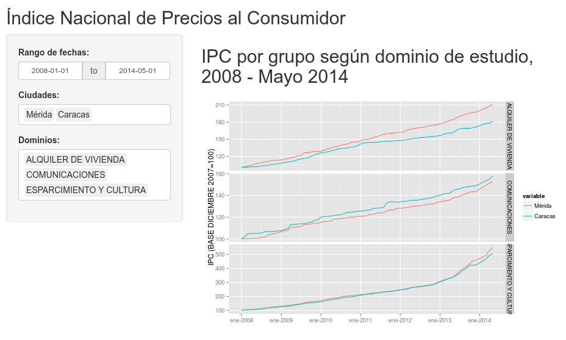

## En Homenaje 

> *a la Lic. Karla Contreras Dávila*

# R

## R

- No debería ser necesario a estar alturas tener que explicar en unas Jornadas
Estadísticas que es R.

- Se puede encontrar una introducción en http://bit.ly/introR

- R es el entorno de análisis estadístico y generación de gráficos más avanzado,
más utilizado, más flexible, más potente y con la mejor relación precio/valor
del planeta.

- Para usar R de forma eficaz y eficiente tienes que saber programar. Por lo
general, la gente no sabe programar porque el uso de la ofimática (léase: Word y
Excel) les ha inhabilitado para aprender.

## Instalar R I

### En Windows

- http://www.r-project.org $\rightarrow$ `CRAN`  
$\rightarrow$ `0-Cloud` http://cran.rstudio.com/  
$\rightarrow$ `Download R for Windows`  
$\rightarrow$ `install R for the first time`  
$\rightarrow$ `Download R 3.1.3 for Windows`

- Se descarga el archivo http://cran.rstudio.com/bin/windows/base/R-3.1.3-win.exe
y se ejecuta el instalador.

## Instalar R II

### En Linux

- La versión que viene en los repositorios oficiales de las principales
distribuciones linux suele estar obsoleta.

- Para obtener la versión mas reciente de R se añade el repositorio apropiado según se indica en http://cran.rstudio.com/bin/linux/ubuntu/, y se ejecutan los siguientes comandos:

- ```
$ sudo apt-get update
$ sudo apt-key adv --keyserver keyserver.ubuntu.com --recv-keys E084DAB9
$ sudo apt-get install r-base r-base-dev
```

## RStudio

- Tienes que tener previamente instalado R o R Open  
http://mran.revolutionanalytics.com/open/  
(Revolution Analytics fue comprada por Microsoft)

- http://www.rstudio.com/  
$\rightarrow$  `Download RStudio`  
$\rightarrow$  `Download RStudio Desktop`

- Seleccionar el instalador apropiado para nuestra plataforma (Windows|Mac OS X|Linux).

- Descargar e instalar.

## Interfaz de RStudio


# Reportes dinámicos

## knitr

- [knitr](http://yihui.name/knitr/) ha sido desarrollado por Yihui Xei, Phd por
el Dpto. Estadística Iowa State. Actualmente empleado por RStudio Inc.

- Es un paquete genérico para intercalar código R ejecutable con texto en diversos
formatos (por ejemplo: LaTeX, HTML, Markdown, AsciiDoc, y reStructuredText).

- El formato de texto que ha ganado mayor difusión es **R Markdown**.

## Flujo de trabajo con knitr

1. Abrir un archivo con la extensión `.Rmd`.

2. Preparar el documento con la sintaxis `R Markdown`.

3. Insertar trozos de código en R para las salidas dinámicas del reporte.

4. Generar el documento, lo que reemplaza el código R por su salida, y
transformar el reporte al formato indicado: presentación, pdf, html o ms Word.

## Ejemplo # 1a

```{r}
# Un ejemplo de código fuera de `R` aquí;
# sabemos que el valor de $\pi$ es `r pi`.
# 
# ```{r, echo=FALSE, fig.height=3, fig.width=6}
# set.seed(1213)  # para hacerlo reproducible
# x <- cumsum(rnorm(100))
# mean(x)  # media de x
# plot(x, type = 'l')  # Brownian motion
# ```
```

## Ejemplo 1b

Un ejemplo de código fuera de `R` aquí;
sabemos que el valor de $\pi$ es `r pi`.

```{r, echo=FALSE, fig.height=3, fig.width=6}
set.seed(1213)  # para hacerlo reproducible
x <- cumsum(rnorm(100))
mean(x)  # media de x
plot(x, type = 'l')  # Brownian motion
```

## R markdown

- Ver documentación en http://rmarkdown.rstudio.com.

- Para los ansiosos buscar la chuleta respectiva en http://www.rstudio.com/resources/cheatsheets/

- R Markdown es un formato de edición diseñado como una extensión del lenguaje
de marcado ligero markdown al que se le intercalan trozos de código R.

- Los documentos R markdown son completamente reproducibles (puede regenerarse
automáticamente aunque cambie el código R o los datos)

- RStudio utiliza R Markdown v2 con mejoras para formatos de salida,
presentaciones, tablas y bibliografías, personalización de la salida,
compilación desde scripts de R, extensible, etc.

## Trozos (chunks) de R

- Es código R que va encerrado entre

- ```
# ```{r}
# ```
```

- Después de la `r` se pueden introducir opciones separadas por comas.

- Estas opciones controlan la salida y el procesamiento de estos trozos de
código.

- Soporta el uso de "cache" y la inclusión de trozos de `Rcpp`

## YAML

- Al principio de los documentos se indican los metadatos y las opciones de
procesamiento utilizando el lenguaje de marcado ligero YAML "YAML Ain't Markup
Language"

- Es un formato de serialización legible para humanos, usado para compartir
datos como sustitución de XML.

- ```
# ---
# title: "Reportes Dinámicos y Aplicaciones Web interactivas con R"
# author: "Francisco Palm"
# date: "18 de marzo de 2015"
# output:
#   ioslides_presentation:
#     incremental: yes
# ---
```

## Ejemplo 2

- R crash course in R

- Script de Robin Edwards UCL/CASA http://geotheory.co.uk/blog/a-crash-course-in-r/

- Ejecutar `rmarkdown::render("r_crash_course.R")`

- Para ver los archivos intermedios `rmarkdown::render("r_crash_course.R", clean=FALSE)`


## Tablas

 - Existen varias opciones para renderizar las tablas en R markdown:
 
 - `kable()` es una función incluida en el paquete knitr, es buena para la mayoría de las situaciones. Requiere cargar explícitamente el paquete `knitr` con `library(knitr)`.
 
 - `pander()` es una buena opción, es necesario instalar el paquete `pander`. Se debe cargar en el código del trozo de R con `library(pander)`.
 
 - `xtable()` es la opción más flexible, también en su propio paquete `xtable`. Se debe cargar igualmente. Requiere utilizar la opción `results=asis` en la cabecera del trozo.


## Aplicar CSS

- Para personalizar la apariencia de nuestros reportes en HTML podemos utilizar hojas de estilo en cascada (CSS).

- En los reportes disponemos de varias opciones del proyecto https://bootswatch.com, temas de código abierto derivados de bootstrap. (quiere decir que alguien mas hizo el trabajo por nosotros). En un documento `.Rmd` seleccionar de `Apply Theme:`.

- Se pueden crear archivos CSS que cambien la apariencia de elementos particulares del documento.

## Ejemplo 3

- Uso de `kable`, `pander` y `xtable` en R markdown.

- Abrir el archivo `rmd_tables.Rmd` y observar como los distintos paquetes renderizan las tablas.

- Ahora desde las opciones de formato (botón de engranaje al lado derecho de `Knit HTML`), activar la opción `Apply CSS file` y seleccionar el archivo `flat-table.css`.

- Observar como los nuevos estilos modifican la apariencia de las tablas.


## Rpubs.com

- Servicio para publicar y compartir nuestros documentos y presentaciones HTML generados con `knitr`.

- Utilizando la opción `Publish` en la barra superior del visor HTML de RStudio se puede publicar nuestro trabajo en RPubs.

- Es una excelente lugar para encontrar ejemplos de documentos y presentaciones realizados con estas herramientas.

## Presentación

- Este documento es un ejemplo de una presentación hecha con Rmarkdown, utilizando el motor `ioslides`.

- En las presentaciones la sintaxis markdown se utiliza con una lógica diferente, por ejemplo los encabezados de primer nivel `#` determinan las partes de la presentación, los encabezados de segundo nivel `##` determinan las láminas.

- Existen algunas opciones de configuración que dependen de cada motor de generación. Esta misma presentación es el ejemplo.

# Web Interactiva

## googleVis

- `googleVis` es un paquete de R que da acceso desde R a Google Charts. Las funciones de este paquete permiten al usuario visualizar los datos con las herramientas de Google Chart se necesidad de subir los datos a Google.

- La salida de las funciones de `googleVis` es código html que contiene datos y referencias a la información almacenada por Google. Para visualizar los resultados se requiere un navegador con Flash.

- Podemos ver algunos ejemplos por acá: http://cran.r-project.org/web/packages/googleVis/vignettes/googleVis_examples.html

## rCharts

-  rCharts es un paquete de R que permite crear, personalizar y compartir visualizaciones web interactivas desde R, utilizando una interfaz familiar tipo lattice.

- Permite trabajar con distintas bibliotecas de javascript, y permite trabajar con mapas utilizando la biblioteca de mapas leaflet.

- La gran diferencia con googleVis es que todas las dependencias son libres y las podemos
utilizar en nuestra propia plataforma y sin conexión de Internet.

- Podemos ver algunos ejemplos acá http://ramnathv.github.io/rCharts/

## Shiny

- `Shiny` es una plataforma para crear programas interactivos basados en R incrustados en una página web.

- Si quiere crear un algoritmo de predicción, con shiny puede *muy fácilmente* crear un formulario de entrada que llama a R y a partir del cual su algoritmo de predicción  muestra los resultados.

- Usando `Shiny`, el tiempo para crear productos de datos interactivos desde R se minimiza. Aunque carece de la flexibilidad de soluciones mas completas (y complejas).

- `Shiny` está hecho por el equipo de trabajo de RStudio.

## Estructura

- Un proyecto de `Shiny` es un directorio que contiene al menos dos partes (que pueden estar en un mismo archivo o, es preferible, en archivos separados:

  - Una llamada `ui.R` (para la interfaz de usuario) que controla la apariencia.
  
  - Otra con nombre `server.R` que controla como lo hace.

## `ui.R`

- Contiene los elementos de entrada de la interfaz, por ejemplo:

- ```
inputPanel(
  selectInput("n_breaks", label = "Number of bins:",
              choices = c(10, 20, 35, 50), selected = 20),
  sliderInput("bw_adjust", label = "Bandwidth adjustment:",
              min = 0.2, max = 2, value = 1, step = 0.2)
)
```

- En este caso `n_breaks` y `bw_adjust` son los nombres de los elementos (widgets).


## `server.R`

- Por su parte `server.R` tiene funciones que reciben como entrada un bloque de código, por eso va encerrado entre llaves `{}`.

- Nótese como para hacer referencia a los valores la entrada se escriben como `input$nombre`.

- ```
renderPlot({
  hist(faithful$eruptions, probability = TRUE,
       breaks = as.numeric(input$n_breaks),
       xlab = "Duration (minutes)",
       main = "Geyser eruption duration")
  dens <- density(faithful$eruptions,
                  adjust = input$bw_adjust)
  lines(dens, col = "blue")
})
```

## Otras cosas que puede hacer Shiny

- Permitir a los usuarios cargar o descargararchivos

- Tener paneles principales de pestañas.

- Tener tablas de datos editables.

- Tener una interfaz gráfica interactiva.

- Entradas y salidas definidas por el usuario.

- Poner un botón de *enviado* de forma tal que Shiny solamente ejecute código complejo despuésque el usuario lo pulse.


## Ejemplo con datos del IPC

- Se tomaron datos del portal del INE (que también están en el portal del BCV), en la página, `Indice de Precios al Consumidor`:

- http://www.ine.gob.ve/index.php?option=com_content&view=category&id=108&Itemid=62

- Seleccionar `INPC POR CIUDADES` y después `Por grupo según dominio de estudio, 2008 - Mayo 2014`:

- http://www.ine.gob.ve/documentos/Economia/IndicedePreciosalconsumidor/xls/PorCiudades/4_6_3.xls

## Procesamiento de los datos

- Los datos están en un archivo de excel con 75 hojas, cada una contiene los datos mensuales del IPC desde enero 2008 hastamayo 2014 en las 10 ciudades mas grandes de Venezuela para 13 "dominios" (alimentos, bebidas alcohólicas, vestido, alquiler, etc.)

- La carga de los datos es truculenta porque esta hoja de cálculo es editada a mano, en consecuencia hay pequeñas diferencias en la localización de los datos en las hojas. Para los detalles ver `read_data.R` en el repositorio https://github.com/map0logo/devdataprod-011

- ```{r}
load("data.Rdata")
```

- Se obtiene como resultado un data frame `data` con: `r nrow(data)` observaciones y `r ncol(data)` variables.

## Diseño de la interfaz

- La interfaz tiene un `sidebarPanel`:

 - un `dateRangeInput` para las fechas
 - un `selectInput` para las ciudades, y
 - otro `selectInput` para los dominios

- Y en un `mainPanel` que genera un gráfico automático con la serie de tiempo del IPC para el rango de fechas seleccionado y separado por dominios.

- El gráfico es generado usando `ggplot2`

## Captura de pantalla



## Notas finales

- Se puede acceder a la aplicación en https://mapologo.shinyapps.io/dp_mapologo y el código se encuentra en  https://github.com/map0logo/devdataprod-011

- Es una pequeña demostración del poder y la flexiblidad para generar reportes dinámicos directamente desde los datos. Datos públicos reproducibles.

- En lugar de ofrecer archivos de excel engorrosos y poco prácticos, las aplicaciones Shiny permiten mostrar información de una manera atractiva y dinámica, mucho mas útil para ganar comprensión y en consecuencia mas apropiada para el análisis y la toma de decisiones informada.

- Esta presentación es reproducible, los fuentes y todos los archivos asociados se encuentran en: https://github.com/map0logo/jornadas_karla 
